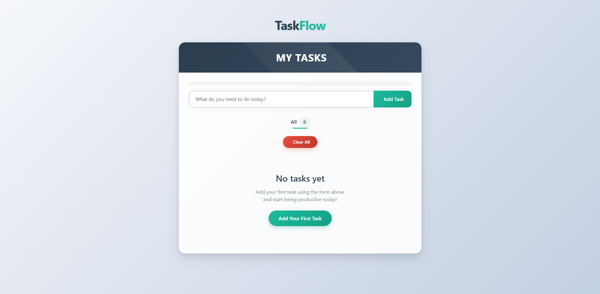

# Angular To-Do Application

A simple and intuitive task management application built with Angular that helps you keep track of your daily tasks.



## Features

Add new tasks to your to-do list
Mark tasks as complete
Remove tasks from the list
Display a congratulatory message when all tasks are completed

Getting Started

## Development server

To start a local development server, run:

```bash
ng serve
```

Once the server is running, open your browser and navigate to `http://localhost:4200/`. The application will automatically reload whenever you modify any of the source files.
